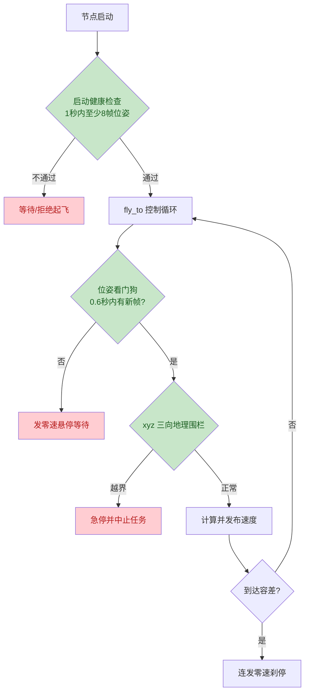

# 用 ROS 2 + Gazebo 打造城市应急物资投送无人机：从起飞、乱飞事故到安全闭环

> 本文记录了参加 iCAN 任务二"城市应急物资投送"仿真练习的全过程：如何在只有 ROS 2 接口、没有现成导航与视觉方案的用户版环境里，从零写出一个能自主完成"起飞 → 穿窗 → 四点投放 → 穿窗返回 → 精准降落"的任务节点，以及期间一次真实"乱飞事故"带给我们的工程教训。

## 一、任务背景：一个"只给接口、不给答案"的训练场

拿到工作区后第一件事不是写代码，而是读懂这个仿真环境给了什么：

- **场景**：一个带围墙的场地，包含 1 个起降坪（delivery_pad）、4 个圆形投放靶（drop_1 ~ drop_4，对应黑/白/红/黄四种颜色）、2 道需要穿越的窗口（window_1、window_2）。
- **无人机**：四旋翼，机腹携带 4 个 5cm 立方体物块。
- **关键 ROS 2 接口**：

| 话题/接口 | 方向 | 作用 |
|---|---|---|
| `/flight_control/current_pose` | 订阅 | 无人机在世界坐标系下的实时位姿 |
| `/flight_control/cmd_vel` | 发布 | 机体系速度指令（线速度 + 偏航角速度） |
| `/delivery/drop_cmd` | 发布 | 发布颜色字符串，投放对应物块 |
| `/delivery/package_state` | 订阅 | 物块携带/已投放状态与事件 |
| `/uav/camera/image`、`/uav/lidar/points` | 订阅 | 前置相机与三维激光（留给选手做感知） |

用户版环境**没有裁判、没有导航包、没有视觉识别**——所有策略都要自己实现。这恰恰是这类练习最有价值的地方：接口极简，但决策全开放。

工作区里自带一个 `minimal_drop_demo` 示例，演示了"起飞 → 下降 → 投一个物块 → 拉升 → 降落"的最小流程。它提供了一个非常关键的可复用函数 `fly_to`：输入**世界坐标系**下的目标点，内部自动完成世界系误差到机体系速度指令的变换。后续的完整任务节点，就是站在这个函数的肩膀上写出来的。

## 二、第一版：用航点把完整任务拼出来

任务的物理路线是这样的：起降坪在场地东侧，4 个投放点在西侧，中间有两道墙，必须通过窗口往返。

```
起飞(0.9m)
  → 穿 window_2 进入西侧（南）
  → 投放 red    → 投放 yellow
  → 西侧北移
  → 投放 black  → 投放 white
  → 穿 window_1 回东侧
  → 返回起降点 → 降落
```

在 `full_mission.py` 中，我们把它抽象成三个层次的 API：

- **原子动作**：`fly_to(目标点)` 定点飞行、`stop()` 刹停、`drop(颜色)` 投放。
- **组合技能**：`cross_window(窗口坐标, 方向)` = 进近到窗口东侧/西侧 → 降到窗口高度 → 平飞穿过 → 回升到巡航高度；`do_drop_at(颜色, 靶心坐标, 航向)` = 飞至靶心 → 下降到投放高度 → 投放 → 回升。
- **任务流程**：`run()` 按 7 个阶段依次调用上述技能。

这种"原子动作 → 组合技能 → 任务流程"的三层结构，让后续改路线、调参数都很容易——想换投放顺序、改巡航高度，只需要调整参数或航点表，不必动控制内核。

第一版运行得相当顺利：约 40 秒跑完全程，4 个物块全部投出，最终坐标 `(3.07, -2.38)` 与起降坪目标几乎完全重合。

## 三、事故现场：无人机在 GUI 里"蒙眼乱飞"

然而，当我们为了观看效果，用 **Gazebo 图形界面（GUI）模式**启动时，意外发生了：无人机起飞后不久就偏离航线，最终冲出了场地。

排查后发现，这不是算法算错了，而是一个典型的**控制安全问题**，链条如下：

1. GUI 启动瞬间，虚拟机要同时加载场景和渲染画面，出现明显卡顿；
2. Gazebo 的物理仿真一度停滞，`/flight_control/current_pose` 停止更新；
3. 而控制节点没有检查"位姿是否新鲜"，继续拿着**最后一帧冻结的位姿**反复计算误差；
4. 冻结的位姿 + 固定的目标点 = 一组恒定的非零速度指令，被持续发布；
5. 等仿真恢复、指令真正生效时，飞机已经朝着错误方向飞了很远。

换句话说：**节点在"闭眼"的状态下还在不停下命令。**

## 四、四道安全防线：让"乱飞"在物理上不可持续

针对事故链条，我们给任务节点加上了四层防护：



1. **启动健康检查**：起飞前先确认位姿以稳定频率到达（1 秒内 ≥ 8 帧），仿真加载再慢也会等它就绪；
2. **位姿看门狗**：飞行中一旦超过 0.6 秒没收到新位姿，立即发布零速悬停，恢复后再继续；
3. **三向地理围栏**：x、y、z 三个方向各设边界（z 方向是后来补上的），一旦越界立刻急停中止；
4. **退出兜底急停**：无论是正常结束、异常还是 Ctrl+C，`finally` 中都会持续发 0.6 秒零速，确保底层不会残留最后一条非零指令。

这里有一个重要的认知转变：**机器人控制代码不能假设"数据永远新鲜、世界永远正常"。** 上位机看到的每一帧数据都可能延迟、冻结或出错，安全逻辑必须建立在"异常随时会发生"的前提上。

## 五、代码审查：比"飞不飞得稳"更隐蔽的，是"假成功"

安全问题解决后，我们又对代码做了一次系统性的代码审查，结果发现：飞行安全机制已经到位，但**任务结果的正确性**还存在两个隐蔽缺口——它们不会让飞机乱飞，却会让程序"谎报成功"。

### 缺口 1：投放顺序参数不校验

节点支持通过 `drop_order` 参数自定义投放顺序。最初的实现只是用白名单过滤一遍：

```python
south_colors = [c for c in drop_order if c in ("red", "yellow")]
```

这意味着，一旦把 `red` 拼成 `rede`，非法条目会被**静默丢弃**，可能一个物块都不投，无人机却照样飞完全程，最后打印"任务完成"。

修复方式是在起飞前做严格校验——为空、出现非法颜色、存在重复条目，都直接安全中止：

```python
if not drop_order:
    raise MissionAbort("drop_order 为空。")
invalid = [c for c in drop_order if c not in VALID_COLORS]
if invalid:
    raise MissionAbort(f"drop_order 含非法颜色 {invalid}，合法值：{list(VALID_COLORS)}")
if len(set(drop_order)) != len(drop_order):
    raise MissionAbort(f"drop_order 含重复条目：{drop_order}")
```

这是典型的**防呆（fail-fast）设计**：让错误在发生的第一时间、以最明确的方式暴露出来，而不是等到任务结束才发现物块没投对。

### 缺口 2：投放结果不确认

最初的 `drop()` 只发一次命令、睡 0.8 秒就返回，从不检查物块是否真的投出：

```python
self.drop_pub.publish(String(data=color))
time.sleep(0.8)
```

如果物块此前已被释放（装置会回 `drop_ignored_already_released` 事件）或命令恰好丢失，流程仍按成功继续。修复后，节点会解析 `/delivery/package_state` 中 `dropped=` 列表，限时等待该颜色真正出现，期间持续发零速；未确认则自动重试一次，仍失败就中止任务。

这次审查带来的启示是：**评估一个自主系统，"会不会出事"和"会不会假装成功"同样重要。** 对关键动作的结果做闭环确认，是开环脚本走向可靠系统的分水岭。

## 六、第二个大坑：3 个飞控节点同时在说话

修复完代码后，我们在一次运行中又遇到了诡异现象：节点日志先显示"穿窗成功"，紧接着却报"越出地理围栏 x=4.41"——飞机明明在往西穿窗，位姿却显示它在场地最东边。

用 `ros2 node list` 一查，真相大白：

```
/flight_control_node
/flight_control_node
/flight_control_node
```

图里同时存在 **3 个同名飞控节点**，`/flight_control/current_pose` 有 3 个发布者。原来之前多次清理进程时，只杀掉了 launch 父进程，它已经拉起的飞控节点变成了**孤儿进程**，继续发布陈旧或错位的位姿。任务节点订阅同一份话题时，收到的是 3 个来源混杂的位姿，自然被误导。

解决分两步：

1. 按进程名精确定位并清除所有孤儿飞控节点和静态 TF 发布器（而不是只杀 launch）；
2. 执行 `ros2 daemon stop` 清掉发现服务的节点缓存——否则 `ros2 node list` 仍会显示早已死亡的节点，造成"怎么杀都杀不掉"的错觉。

并把"起飞前断言"固化为每次运行的第一步：

```bash
# 应恰好只有一个 /flight_control_node
ros2 node list | grep flight_control
# 位姿发布者应恰好 1 个
ros2 topic info /flight_control/current_pose
```

这也印证了一条朴素的经验：**重启 ≠ 干净。** 当 ROS 图里出现同名节点、重复 TF、时间戳混杂时，先收敛环境、断言图的唯一性，再谈验证算法，否则在污染的环境里调试，只会得到互相矛盾的结论。

## 七、最终成果与可改进方向

最终版本在干净隔离的环境中可以稳定跑通完整流程：

- 7 个阶段约 40 秒完成，4 个物块逐一投放并得到确认；
- 最终落点 `(3.070, -2.380, 0.20)`，与起降坪目标误差小于 1 厘米；
- 具备健康检查、位姿看门狗、三向围栏、退出急停、参数防呆、投放结果确认六道保障。

当然，路线在拐角处仍有轻微瑕疵——当前方案本质是**预设坐标 + 开环巡航**，对风扰和碰撞后的恢复能力有限。下一步可以从这些方向继续打磨：

- 拐角航点平滑过渡，减少急转和小幅绕路；
- 穿窗时对窗口中心做二次对位；
- 利用 `/uav/lidar/points` 点云做简单避障；
- 投放前基于相机画面识别靶心并微调位置；
- 把 `fly_to` 的 P 控制升级为带速度前馈的 PID，改善 GUI 模式下因仿真迟滞造成的高度过冲。

## 写在最后

这次练习最有价值的收获，不是飞机飞完了一条航线，而是过程中被迫学会的几件事：

1. **先读懂接口边界，再动手写代码**——知道环境不给什么，才知道自己要补什么；
2. **对数据保持怀疑**——位姿会冻结、会错乱、会有多个来源，安全逻辑要按"异常是常态"来设计；
3. **对结果坚持确认**——关键动作没有闭环确认，"任务完成"四个字就不可信；
4. **调试环境先于调试算法**——同名节点、孤儿进程、发现缓存，这些"场外因素"不排除，再聪明的算法也会被冤枉。

从一个能飞的 Demo，到一个出问题不会乱飞、结果不会谎报、环境必须干净的可靠节点，这中间的距离，大概就是"跑通"和"做好"之间的距离吧。
